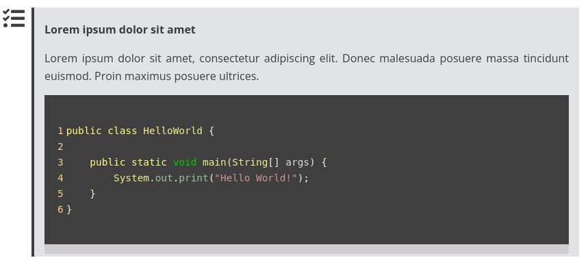
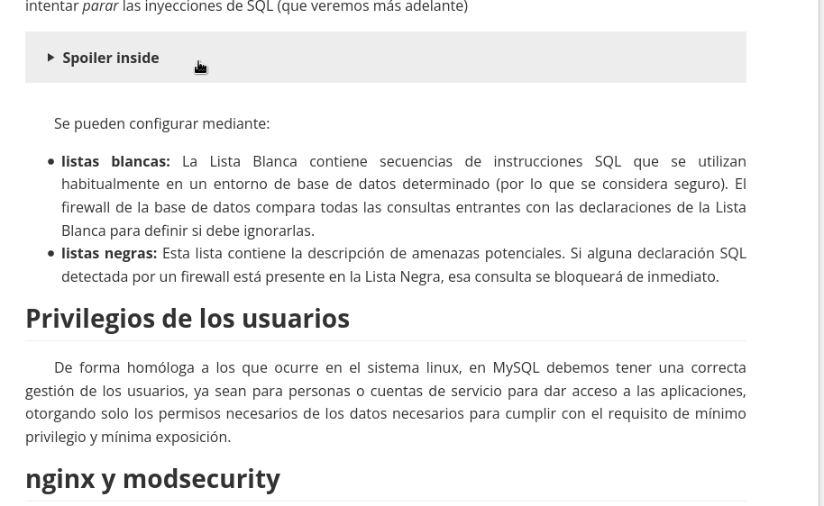

# Instalación

El presente documento es una guía para la instalación de este tema de Jekyll del que se puede ver una [demo](https://victorponz.github.io/Ciberseguridad-PePS/)

Sigue los siguientes pasos:

1. Crea un fork de este repositorio

2. Conviértelo en **GitHub Pages**. 
   Visita la url `https://github.com/usuario/repo/settings/pages` y sigue los pasos.

3. Modifica el archivo `_config.yml`

   ```
   github_username:  usuario
   github_repo:  usuario/tu-nombre-de-tu-repo
   baseurl: /tu-nombre-de-tu-repo
   ```
4. Modifica los archivos `index.html`  e `index-popup.html` y adáptalos a tus necesidades.
5. Sube todos los archivos a GitHub

   ```
   git add .
   git commit -m "Primera versión"
   git push
   ```

6. Al poco tiempo tendrás la primera versión de tu web en `https://usuario.github.io/repo/`

## Cómo crear un nuevo post

Los post se deben guardar dentro de la carpeta `_posts` y deben seguir el formato `yyyy-mm-dd-nombre-del-post.md`

En el `front-matter` aparecen muchos campos que creo que son auto-explicables y permiten cambiar por ejemplo el título, el `tema` (en la variable `categories`), el directorio en el que están las imágenes, etc.

`categories` es importante porque discrimina en qué apartado de la página de portada aparece el enlace al post:

```jade
<h3>Tema 1 - Introducción</h3>
<ol class='portada'> 

    
      <li><h4><a href="{{site.baseurl}}{{ post.url }}">{{ post.title }}</a></h4></li>
    

</ol>
```
Aunque se puede prescindir de la categoría y mostrar todos los posts

## Cómo generar el pdf

Como prerequisito se debe tener instalado [pandoc](https://pandoc.org/)

La imagen que se usa en la portada está en `assets\img\modelo-portada.svg` Genera una imagen png y modifica el front-matter de tu post con la ruta a esta imagen

```
titlepage-background: assets/img/git-basico/dibujo.png
```

Ahora ejecuta este comando:

```
pandoc _posts/nombre-de-archivo.md --pdf-engine=xelatex --resource-path=.:/home/victorponz/Documentos/2020-21/Ciberseguridad/..  -o assets/pdf/nombre-de-archivo.pdf --template=eisvogel.tex --toc --highlight-style tango --filter pandoc-latex-environment --variable urlcolor=cyan
```

## Goodies

Se ha añadido la posibilidad de crear diferentes cajas de texto.

### Tarea



El código markdown que la genera es el siguiente:

<div style='border: 1px solid black; padding:8px'>
<p>
> -task-Lorem ipsum dolor sit amet
</p>
<p>
> Resto de markdown
</p>
</div>

Es decir, el **blockquote** debe empezar con la etiqueta `task` entre dos guiones `-`.
El resto de markdown se renderizará normalmente.

### Reto

Cambia la etiqueta por `reto`


### Alerta

Cambia la etiqueta por `alert`


### Info

Cambia la etiqueta por `info`


### Pista

Cambia la etiqueta por `hint`


### Aviso

Cambia la etiqueta por `warning`


### Toogle

Cambia la etiqueta por `toogle`. En este caso, el primer párrafo que escribamos se convierte en el texto del `toogle`


