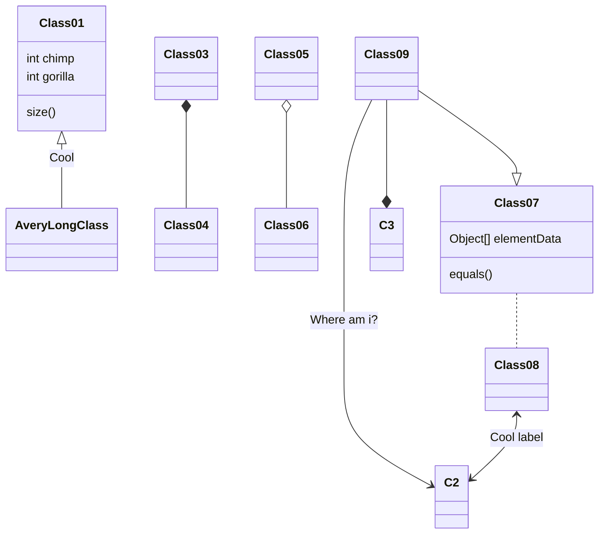
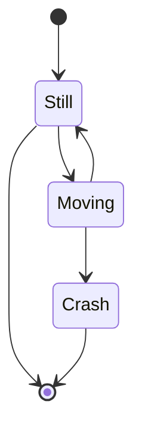
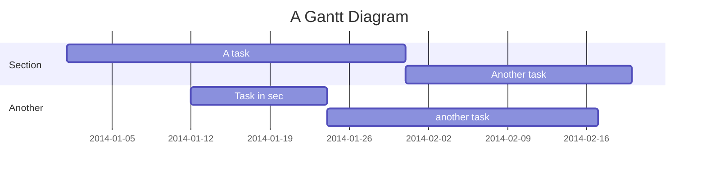

Además de poder usar el formato de markdown, se añaden las siguientes características:
# Tarea
> -task-**Lorem ipsum dolor sit amet**
>
> Lorem ipsum dolor sit amet, consectetur adipiscing elit. Donec malesuada posuere massa tincidunt euismod. Proin maximus posuere ultrices.
>
> ```java
> public class HelloWorld {
> 
>     public static void main(String[] args) {
>         System.out.print("Hello World!");
>     }
> }
> ```
>
> 

Estos estilos se consiguen mediante el siguiente markdown:

<div style='border: 1px solid black; padding:8px'>
<p>
> -task-Lorem ipsum dolor sit amet
</p>
<p>
> Resto de markdown
</p>
</div>
Es decir, el **blockquote** debe empezar con la etiqueta `task` entre dos guiones `-`.
El resto de markdown se renderizará normalmente.
## Reto
Cambia la etiqueta por `reto`
> -reto-**Lorem ipsum dolor sit amet**
>
> Lorem ipsum dolor sit amet, consectetur adipiscing elit. Donec malesuada posuere massa tincidunt euismod. Proin maximus posuere ultrices. Morbi  ipsum velit, ultrices sit amet ex a, accumsan blandit tortor.
>

## Alerta
Cambia la etiqueta por `alert`
> -alert-**Lorem ipsum dolor sit amet**
>
> Lorem ipsum dolor sit amet, consectetur adipiscing elit. Donec malesuada posuere massa tincidunt euismod. Proin maximus posuere ultrices. Morbi ipsum velit, ultrices sit amet ex a, accumsan blandit tortor.


## Info
Cambia la etiqueta por `info`
> -info-**Lorem ipsum dolor sit amet**
>
> Lorem ipsum dolor sit amet, consectetur adipiscing elit. Donec malesuada posuere massa tincidunt euismod. Proin maximus posuere ultrices. Morbi  ipsum velit, ultrices sit amet ex a, accumsan blandit tortor. 


## Pista
Cambia la etiqueta por `hint`
> -hint-**Lorem ipsum dolor sit amet**
>
> Lorem ipsum dolor sit amet, consectetur adipiscing elit. Donec malesuada posuere massa tincidunt euismod. Proin maximus posuere ultrices. Morbi  ipsum velit, ultrices sit amet ex a, accumsan blandit tortor.
> 


## Aviso
Cambia la etiqueta por `warning`
> -warning-**Lorem ipsum dolor sit amet**
>
> Lorem ipsum dolor sit amet, consectetur adipiscing elit. Donec malesuada posuere massa tincidunt euismod. Proin maximus posuere ultrices. Morbi ipsum velit, ultrices sit amet ex a, accumsan blandit tortor.
> 


## Toogle

Cambia la etiqueta por `toogle`. En este caso, el primer párrafo que escribamos se convierte en el texto del `toogle`

> -toogle-**Lorem ipsum dolor sit amet**
>
> Lorem ipsum dolor sit amet, consectetur adipiscing elit. Donec malesuada posuere massa tincidunt euismod. Proin maximus posuere ultrices. Morbi ipsum velit, ultrices sit amet ex a, accumsan blandit tortor.

# Diagramas - Mermaid

Crear diagramas y visualizaciones (flowchart, sequence, class diagram, state diagram, Gantt, pie chart, requeriment diagram, etc) con [Mermaid](https://mermaid-js.github.io/mermaid/#/),  introduce un bloque de código con código de lenguaje `mermaid`

```
classDiagram
Class01 <|-- AveryLongClass : Cool
Class03 *-- Class04
Class05 o-- Class06
Class07 .. Class08
Class09 --> C2 : Where am i?
Class09 --* C3
Class09 --|> Class07
Class07 : equals()
Class07 : Object[] elementData
Class01 : size()
Class01 : int chimp
Class01 : int gorilla
Class08 <--> C2: Cool label
```

Este es el resultado:



Diagrama de estado:

```
stateDiagram-v2
    [*] --> Still
    Still --> [*]

    Still --> Moving
    Moving --> Still
    Moving --> Crash
    Crash --> [*]
```



Gantt

```
gantt
    title A Gantt Diagram
    dateFormat  YYYY-MM-DD
    section Section
    A task           :a1, 2014-01-01, 30d
    Another task     :after a1  , 20d
    section Another
    Task in sec      :2014-01-12  , 12d
    another task      : 24d
```



Dispones de más ejemplos en la página de [Mermaid](https://mermaid-js.github.io/mermaid/#/)

# Diagramas de flujo

Crear diagramas de flujo con [Flowchart](https://flowchart.js.org/),  introduce un bloque de código con código de lenguaje `flow`

```
st=>start: Start:>http://www.google.com[blank]
e=>end:>http://www.google.com
op1=>operation: My Operation
sub1=>subroutine: My Subroutine
cond=>condition: Yes
or No?:>http://www.google.com
io=>inputoutput: catch something...
para=>parallel: parallel tasks

st->op1->cond
cond(yes)->io->e
cond(no)->para
para(path1, bottom)->sub1(right)->op1
para(path2, top)->op1
```

Este es el resultado:

```flow
st=>start: Start:>http://www.google.com[blank]
e=>end:>http://www.google.com
op1=>operation: My Operation
sub1=>subroutine: My Subroutine
cond=>condition: Yes
or No?:>http://www.google.com
io=>inputoutput: catch something...
para=>parallel: parallel tasks

st->op1->cond
cond(yes)->io->e
cond(no)->para
para(path1, bottom)->sub1(right)->op1
para(path2, top)->op1
```


# Sequences

Para conseguir dibujar [Sequences](https://bramp.github.io/js-sequence-diagrams/), introduce un bloque de código con código de lenguaje `sequence`

```
Andrew->China: Says Hello
Note right of China: China thinks\nabout it
China-->Andrew: How are you?
Andrew->>China: I am good thanks!
```

Este es el resultado:

```sequence
Andrew->China: Says Hello
Note right of China: China thinks\nabout it
China-->Andrew: How are you?
Andrew->>China: I am good thanks!
```
